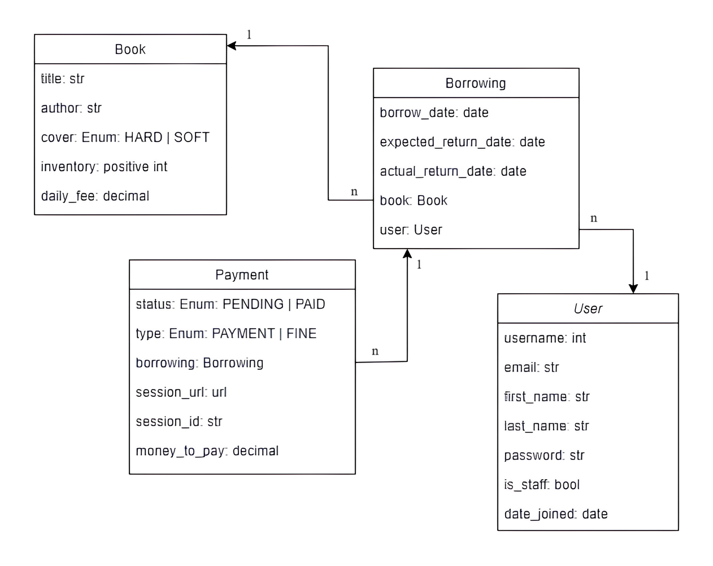

# 📚🚀 Library Service project

This project was created with the goal of creating a 
backend to Library Service. 

The project presents four models:<br>

**library/:**

- `Book`
- `Borrowing`
- `Payment`

**user/:**
- `User`

**Here you can you see the database structure:**



The application has simple connections between the models.
It is important to note that the User model has created using **build-in Django** model and placed in separate app (`user/`).

<br>
<h2>📚 Library Service</h2>

To get started with the project you need to do the following👇:

> Clone the repository
```bash
$ git clone https://github.com/baranovr/library-service-project.git
```

<br />

> Install modules via `VENV`  
### 👉 Set Up for `Unix`, `MacOS`
```bash
$ virtualenv env
$ source env/bin/activate
$ pip3 install -r requirements.txt
```

### 👉 Set Up for `Windows`
```bash
$ virtualenv env
$ souce venv\Scripts\activate
$ pip install -r requirements.txt
```

<br />

> Set your environment variables
```bash
# PostgreSQL settings
$ set POSTGRES_PASSWORD=your_postgres_password
$ set POSTGRES_USER=your_postgres_user
$ set POSTGRES_DB=your_postgres_db
$ set POSTGRES_HOST=your_postgres_host
$ set POSTGRES_PORT=your_postgres_post

# Stripe settings
$ set STRIPE_SECRET_KEY=your_stripe_secret_key

# Django settings
$ set SECRET_KEY=your_secret_key

# Telegram settings
$ set TELEGRAM_BOT_TOKEN=your_telegram_bot_api_token
$ set TELEGRAM_CHAT_ID=your_telegram_chat_id
```

<br />

> Set Up Database

```bash
$ python manage.py makemigrations
$ python manage.py migrate
```

<br>

## 📑 Project general features 
📍JWT Token Authentication

📍Viewing books

📍Ability to borrow book

📍Admin panel /admin/

📍Documentation is located at /api/doc/swagger/

📍Return time tracking

📍Telegram notifications

<br>

<hr>

<h2>🔔Telegram notifications</h2>

<h5>The service has the ability to receive notifications during the creation of a new book, 
new borrowing and deletion of a book.</h5>

### Example:


<h5>It is also possible to receive notifications regarding book debt. 
This is done using Celery.</h5>

<br>

<hr>

<h2>📚🐋 Library Service and Docker</h2>
For convenient development and transfer of the project to other users, Docker was introduced here.
The image has been uploaded to Docker Hub:

### Link👇:
> https://hub.docker.com/repository/docker/baranovr/social_media_platform-app/general

How to use (Docker should be installed)👇:

```bash
docker-compose build
docker-compose up
```

<hr>

## 👮‍♂️ Create Super User

### ⚠️ By default, an unauthorized user does not have the rights to create books or make borrowings.
To be able to interact with the platform, you need to log in.
To be able to use the full functionality, you need to be an **admin** (or `superuser`).
To create a superuser you need to run this command and follow the further instructions👇:
```bash
$ python manage.py createsuperuser
```

<br />
<hr>

## To view functionality, go to the following endpoints👇:

## 📋 Registration:

> .../api/user/register/

## 🎫 Get JWT token:

> .../api/user/token/

## 🎫🔄 Refresh access token:

> .../api/user/token/refresh/

## 🎫✅ Verify access token:

> .../api/user/token/verify/

## 💁‍♂️ Check your profile:

> .../api/user/me/

## 📖 View all books:
### **❗️Only administrators can create and delete books**

> .../api/library/books/

## 📝 Make borrowing:

> .../api/library/borrowings/

<br>

<hr>


## 📂 Code-base structure
```angular2html
< PROJECT ROOT >
   |
   |-- library/  
   |    |-- management/
   |    |    |-- commands/
   |    |        |-- wait_for_db.py         # Custom command for waiting db
   |    |
   |    |-- tests/
   |    |    |-- *.py                       # All test files
   |    |
   |    |-- admin.py                        # Registration models in admin page 
   |    |-- apps.py
   |    |-- models.py                       # All app models
   |    |-- send_notifications.py           # File for sending notifications
   |    |-- serializers.py                  # All app serializers
   |    |-- tasks.py                        # Celery tasks
   |    |
   |    |-- urls.py                         # Paths for pages
   |    |-- views.py                        # All project views
   |
   |-- library_service/
   |    |-- asgi.py
   |    |-- settings.py                     # Defines Global Settings
   |    |-- urls.py                         # Root paths
   |    |-- wsgi.py
   |
   |-- user/                                
   |    |-- admin.py                        # Registration user in admin page
   |    |-- apps.py                         
   |    |-- models.py                       # Folder with user model
   |    |-- serializers.py                  # User serializers
   |    |-- urls.py                         # Urls to login and view info about current user
   |    |-- views.py                        # User view
   |
   |-- .gitignore                           # File with ignored file types to git
   |-- docker-compose.yaml                  # Docker images managing file
   |-- Dockerfile                           # Docker implementation file
   |-- manage.py                            # Start the app - Django default start script
   |-- requirements.txt                     # Development modules
   |-- .env.sample                          # How to set environment variables
   |
   |-- *********************************************************************************
```
